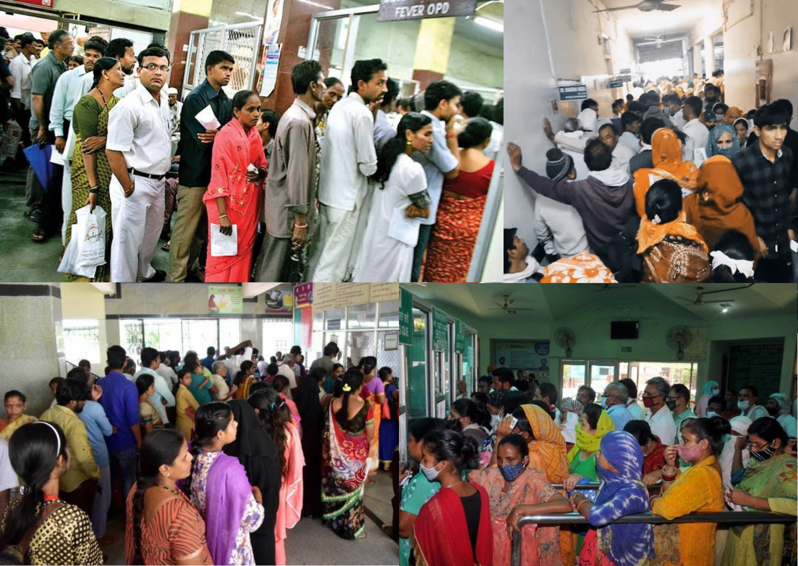

  

<h1 align="center">Spark Healthlines</h1>

   

<h4 align="center">(<a href="https://github.com/Adyasha8105/SPARK-Frontend">Frontend</a> / <a href="https://github.com/Adyasha8105/SPARK-Backend">Backend</a>)</h4>

## Table of Contents

- [About the Project](#about-the-project)
  - [Highlights](#highlights)
  - [Features](#features)
  - [Demo](#Demo)
- [How to use the App](#how-to-use-the-app)
- [Future Enhancement](#features-that-we-are-planning-to-add)
- [License](#license)
- [Our team](#geeks-behind-this)

## About The Project

#### A Virtual Waiting Queue App for Medical use 🩺

[Spark Healthlines](https://spark-healthlines.vercel.app/) is a modern-day designed, enhanced user experience, multi-functional, mobile ready app developed to give in-person patients the freedom to wait for their turn privately in their car—or wherever they choose—rather than confining them to a stuffy, crowded waiting room alongside new germs and potential infections and facilitating a smooth check-in process for healthcare visits 🧑🏻‍⚕️

> Traditional waiting rooms that require patients to touch shared surfaces
> and breathe shared air are beyond uncomfortable—they can be unsafe.
> It is not only incovinient for the patients to stand in long queues but also the crowd prove to be a breeding ground for germs and potential infections.

#### Our Solution

Virtual waiting rooms enable social distancing to support a better patient experience and better outcomes.
A virtual waiting room helps you prevent your healthcare organization from being associated with pesky sounds, smells, people, and boredom that can easily be avoided.

### Demo

Click [here](https://www.youtube.com/watch?v=tjcLdrwBgHY) to see the workflow of the whole project.

### Highlights

✨ No waiting in long queues for booking appointments, patients can book their slot in the comfort of their homes  
✨ Patients can track the queue virtually in the real time and visit the clinic accordingly, no rush or crowd anywhere  
✨ Social Distancing shall be properly practised during the covid times😷

### Features

- Patients can book appointments and tests in the comfort of their homes without manually standing in a queue.
- They can keep full record of there heathcare visits.
- They can easily check the availibity of the doctor without visiting the clinic.
- They don't have to wait or rush around the hospital instead they would be able to know when their turn would arrive by tracking through the app in real-time.
- Doctors can keep a track of the patients visiting them.
- Authentication for both doctors and patients to ensure authenticity and avoid nuisances.
- Both doctors and patients shall be having profiles created with their details on it.
- No other patient or user can view the details of any other patient which maintains the privacy.
- Patients can directly access and book slots, no involvement of any third-party or charge of extra fees.

## How to use the app

#### For patients 👨:

- A new user needs to sign up into the app by clicking on the Get Started button. (Or if you are an existing user you can directly login)
- In the profile tab, update all your details.
- Then you would need to login and be directed to your dashboard.
- You can book your appointment by clicking on the new appointment button, a menu will pop up where you need to fill the date of appointment,choose the desired doctor's name, enter the type and write the symptoms if any.
- After booking your appointment, on the day of your visit, a list would be available showing the approximate timing and queue of your appointment. You can refer to the queue from any place you are and can exactly know when your turn would come. Then you can turn up to the clinic and avoid the crowd or rush.
- In the dashboard, you can view the details of the doctor you booked your appointent with.
- Your appointments are also recorded in the inventory tab for future references.
- You can cancel appointments anytime by clicking on the delete button in the inventory tab.

#### For doctors 👨‍⚕️:

- A new user or existing user needs to sign in into the app by clicking on the Apply as doctor button.
- In the profile tab, update all your details.
- Then you would need to login and be directed to your dashboard.
- In your dashboard, the waiting virtual list of patients of that day would be visible along with the details of the current patient.
- After completion of the visit of a patient, the doctor needs to click on the next button which shall proceed the virtual queue one step ahead.
- This would update the virtual queue and patients shall know their current position and estimated visiting time.

## Features that we are planning to add in future:

- Registrations for hospitals as well.
- Send emails and notifications to patients about the updates in read-time.
- Authentication through OTP.
- Store test reports, prescriptions and maintain a complete health record of the patient.
- Dynamically display the stats of the appointments in the doctor dashboard.
  And many more.

## Geeks behind this

|  |  |  |            |
| ------------------------------------------------------------------------------ | ------------------------------------------------------------------------------ | ------------------------------------------------------------------------------ | ---------------------------------------------------------------------------------------- |
| 
[Piyush Pradhan](https://twitter.com/piyushpradhan07)
    | 
[Shree Mishra](https://twitter.com/mishrashree18)
        | 
[Adyasha Mohanty](https://twitter.com/Adyasha8105)
       | 
[Rupayan Rout](https://www.linkedin.com/in/rupayan-rout-a59b051a0)
 |

## License

Distributed under the GNU License. See `LICENSE.md` for more information.
